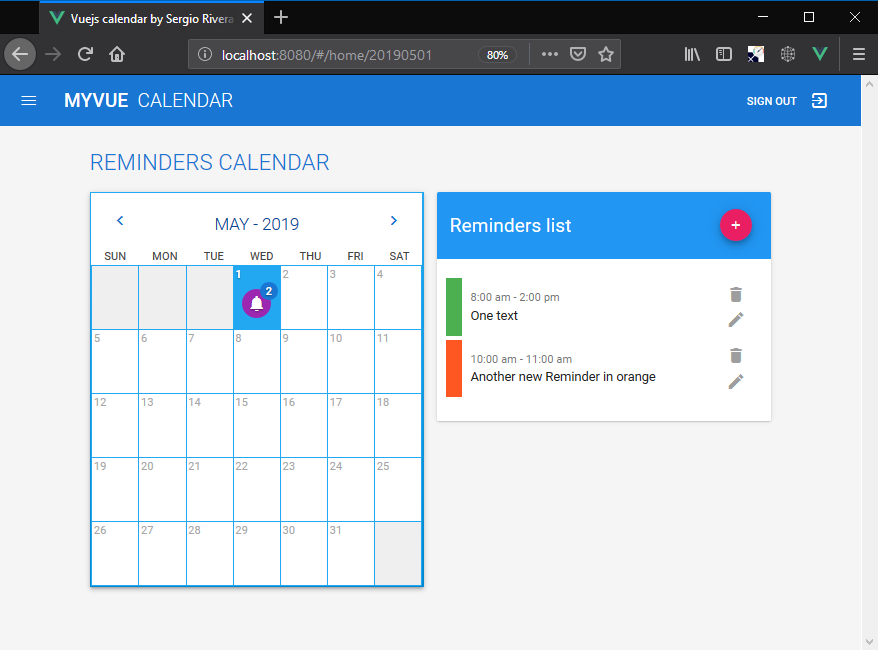
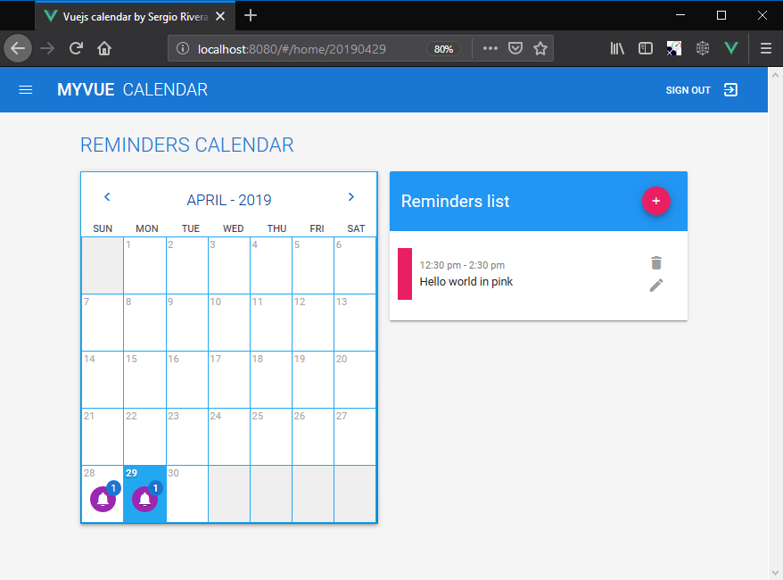

# vuejs-calendar-srivera

## I did use the following third party modules:

- Vuetify : For template and desing
- VeeValidate : For input validations
- vuex-persist : To persist the Data at vuex
- localforage : To save vuex data to localstorage/ indexDB database
- momentjs : To easy manipulate dateTime values and formattings

**Even if Vuetify offers a calendar component I did not use it! I build my own component as stated on the Test description. I use Date Picker though to select a new Date for the Reminder Form**

## Screenshots:

- 
- 
- For more please navigate to "About" menu

## Multilang:

I am trying to setup a multilang (en, es, fr) Project but due to limited time that I have I wont be able to do it :-( ---- _No I wont have the time on 2019-05-01 I must create a Pull Request now :-(_ ----

Thanks for the opportunity

### Sergio Rivera Morales [sergi.erm@gmail.com](mailto:sergi.erm@gmail.com)

## Project setup

```
npm install
```

### Compiles and hot-reloads for development

```
npm run serve
```

### Compiles and minifies for production

```
npm run build
```

### Run your tests

```
npm run test
```

### Lints and fixes files

```
npm run lint
```

### Customize configuration

See [Configuration Reference](https://cli.vuejs.org/config/).

---

## Instructions

The goal of this exercise is to create a demo calendar application using Vue and Vuex. We strongly recommend `@vue/cli` to make the bootstrapping of your application really easy.
Please don't use a `calendar` library, we would like to see your own calendar logic.

### The Task

You should start by rendering a single month view of a calendar for the current month – along with the lines of the `calendar` image in this project.

### Features & Requirements:

- Ability to add a new “reminder” (max 30 chars) for a user entered day and time.
- Display reminders on the calendar view in the correct time order.
- Allow the user to select a color when creating a reminder and display it appropriately.
- Properly handle overflow when multiple reminders appear on the same date.
- Ability to edit reminders – including changing text, day and time & color.
- Ability to delete reminders.
- Expand the calendar to support more than the current month.

### Notes:

- The data should be retained across different page views, but it’s not necessary to persist it beyond a browser refresh.
- This is a coding activity and not a design activity. That’s not to say we don’t appreciate good design or that we don’t value those skills if you have them! It’s just that it won’t have a high value when scoring this particular project.

## F.A.Q.

### How do you evaluate the exercise?

Our evaluation is based on many aspects, such as general approach adopted, quality of code, use of best practices, capabilities to keep the code simple and maintainable.

### How can I deliver the exercise?

To deliver the exercise, you should clone this repository and work on a new branch. When you'll consider it completed, just push the branch and open a Pull Request.
